## Table of contents

1. What is R
2. Programming with R
3. Statistics with R
4. Graphics with R

--- .class #id 

## 1. What is R

>* A statistical package (competitors: Stata, SAS, SPSS, Matlab...)

>* A programming language (object-oriented) 

>* An environment (a huge system of algorithms, packages)

>* A community (over 2 million users worldwide)

>* A de-facto standard among statisticians for the development of statistical methods
	and teaching

---

## Why R

>* Free + Open source
>* Flexible
	  * Open for integration: 
		  * Data: SAS, SPSS, Excel, STATA, SQL Server,...
		  * Systems: applications, webservers,...
	  * Able to combine with other programming languages (Python, C, C++,...)
>* Well-supported community (stackoverflow, github, mailing list, r-blogs,...)
>* Excellent graphics (the best among statistical packages)
>* Highly extensible (over 4300 user-contributed packages)
>* General purpose (statistical analysis, data visualization, machine learning,...)
>* Reproducible research(R + LaTeX)

---

## Install R

* Go to [http://r-project.org](http://www.r-project.org)
* Select any mirror (Vietnam)
* Choose your platform (Windows) and click <i>install R for the first time</i>
* Download <b>R 3.0.0.0 for Windows</b>

---

## Get to know Rgui

__Command line interface (CLI)__: R Console -> an interactive enviroment (workspace)

```r
1 + 1
```

```
## [1] 2
```

```r
x <- "Hello Stata user"
print(x)
```

```
## [1] "Hello Stata user"
```


__R script editor__ (similar to Stata do-file)

---

## Find help

__Access help file__

```r
?rnorm    ## returns documentation of 'rnorm'
```

__Search help files__

```r
help.search("rnorm")  ## finding all functions having keyword: 'rnorm'
## equivalent to: ??rnorm
```

__Get arguments__

```r
args("rnorm")  ## outputs all parameters used by rnorm
```

__Example__

```r
example("mean")  ## give some examples of how to use 'mean'
```

---

## Set your working directory

* All R files or datasets are recommended to store in a defined directory

* Use command: `getwd()` to get your current working directory

* Use command: `setwd()` to change your working directory

* For exampple: `setwd("C:/user/antom/Documents/R")` 

---

## 2. Programming with R

* 2.1 How R works
* 2.2 Object-oriented programming
* 2.3 Data type
* 2.4 Data structure
* 2.5 Getting data in

---

## 2.1 How R works

>* R deploys packages to work on specific tasks. Each package comes with a wide
   range of functions, methods, and datasets.

>* CRAN TASK VIEWS classify all packages in different topics
   [http://cran.r-project.org/web/views/](http://cran.r-project.org/web/views/)

>* Default packages in R. 
   * type: `sessionInfo()` to see loaded packages on workspace
   * type: `installed.packages()` to see installed packages in your computer

>* What's inside an package? 
   * type: `help(package = datasets)` for full detail

>* How to install packages?
   * type: `install.packages("package_name")`, then select any mirror (usually, Vietnam)
   * after that, `library(package_name)` makes it available for use

---

## 2.2 About object-oriented programming

* Everything in R is an object

* Each object belongs to a class (or an instance of the class, 
   by which it inherits all chracteristics of the class)

* Class has its own <b>functions</b> which manipualte objects
   and <b>methods</b> that can be deployed by objects
                
* An example:

```r
x <- 123; y <- 246 ## creat two objects x and y
sum(x + y) ## function: sum() calculates the sum value of two objects x and y
as.character(x) ## function: as.character() transform data type of object x
#######
y - x    ## method: substraction, - (y x)
```

---

## 2.3 Basic data type in R

* Integer: `1, 2, 5`
* Numeric: `1.23`
* Logical: `TRUE, FALSE (abbr: T, F)`
* Complex: `1 + 3i`
* Character (or string): `"character" (or 'character')`
* Factors: `Yes or No`

---

## 2.4 Basic data structure in R

* Vector
* List 
* Matrix
* Array
* Data.frame

---

## 2.4.1 Working with vector

* Vector: the atomic data structure in R, all elements of vector
  must be the same data type

* Declaration

* Common vector operations
  * Arithemetic and logocal operations
  * Vector indexing
  * Generating vector with `:` and `seq()` and `rep()`

* Vectorized operations

---

## Working with vector: declaration

__Using c()__

```r
x <- c(1, 2, 3)
y <- c("A", "b", "C", "d")
z <- c(TRUE, FALSE, TRUE)
g <- c(1 + (0+3i), 2 - (0+5i))
```

__Using vector()__

```r
y <- vector() ## return a vector with length = 0
y <- vector(length = k) ## return a vector length = k
```

---

## Working with vector: Arithemetic and logical operations

```r
c(1, 2, 3) + c(2, 4, 6)
```

```
## [1] 3 6 9
```

```r
c(2, 4, 6)/c(4, 6, 8)
```

```
## [1] 0.5000 0.6667 0.7500
```

```r
c(c(1,2,3), c(5, 6))  # 
```

```
## [1] 1 2 3 5 6
```

---

## Working with vector: indexing
* Problem: want to extract individual/set of elements from a vector

```r
age <- c(22, 23, 24, 26, 36, 36, 36, 23)  ## create a vector
age[1]  ## return the first element; age[k] return the k element
#[1] 22
age[1:3] ## return the three fist elements
#[1] 22 23 24
age[c=(1, 2, 3)] ## same output as age[1:3]
#[1] 22 23 24
age[-3]  ## return all elements except for the third element
#[1] 22 23 26 36 36 36 23
age[3, -2] ## Error, can't index both positive and negative value
```

---

## Working with vector: vectorization

```r
x <- c(12, 34, 54); y <- c(28, 98, 56)
x + y
```

```
## [1]  40 132 110
```

```r
x/y
```

```
## [1] 0.4286 0.3469 0.9643
```

```r
x * 3
```

```
## [1]  36 102 162
```

---

## Working with vector: generating vector

```r
1:5   # seq(1:5) 
```

```
## [1] 1 2 3 4 5
```

```r
seq(1,5, by=2) # seq(from= , to= , by= )
```

```
## [1] 1 3 5
```

```r
rep(1:3, times=4) ## rep(x= , times=, each= )
```

```
##  [1] 1 2 3 1 2 3 1 2 3 1 2 3
```

---

## 2.4.2 Working with list

* Basically, list is a nested vector.
* Example: `my.list <- list(a=c(1:10), b=c("this", "is", "it"))`

```r
my.list <- list(a = c(1:10), b = c("this", "is", "it"))
my.list  ## this list contains 2 elements, each elements is a vector
```

```
## $a
##  [1]  1  2  3  4  5  6  7  8  9 10
## 
## $b
## [1] "this" "is"   "it"
```

---

## Working with list: indexing

```r
my.list <- list(a=c(1:10), b=c("this", "is", "it"))
my.list[[1]]  ## indexing by number
```

```
##  [1]  1  2  3  4  5  6  7  8  9 10
```

```r
names(my.list)
```

```
## [1] "a" "b"
```

```r
my.list["a"]  ## indexing by name
```

```
## $a
##  [1]  1  2  3  4  5  6  7  8  9 10
```

---

## 2.4.3 Working with data frame

* Data frame is a 2x2 matrix, but it can handle different type of data

* Data frame is a rectangular table with columns represent 
  variables and rows represent obsevation

* How to create a data frame: ` df <- data.frame(c1, c2)` 
  with c1 and c2 are vectors

---

## 2.5 Getting data in

* Reading data directly from CLI by `scan()`

* Using `library(foreign)`
* Make sure your data file in your current working directory
  * `getwd()` returns your current working directory
  * `setwd` setting your working directory, e.g: `setwd("C:/user/R")`
* Basic syntax:
  * data <- read.dta("filename.dta",...)
  * data <- read.spss("filename.sav",...)
  * data <- read.csv("filenam.csv",...)
  * data <- read.table("filename.txt",...)
  
* `?read.table` for more instructions  

---

## 3. Statistics with R

* 3.1 Desciptive statistics

* 3.2 Inferential statistics

---

## 3.1 Descriptive statistics

__Data set__

```r
set.seed(10) ## ensure the sample can be reproducible
x <- sample(x = 1:100, size = 20, replace = TRUE) ## choose a random sample from vector x
print(x)  
```

```
##  [1] 51 31 43 70  9 23 28 28 62 43 66 57 12 60 36 43  6 27 40 84
```

---

## 3.1 Desciptive statistics

__Descriptive statistics__

```r
min(x) ## [1] 7
max(x) ## [1] 100
mean(x) ## [1] 56
median(x) ## [1] 60.5
range(x) ## 
summary(x) ## similiar to summarize in Stata
```

---

## 3.2 Inferential statistics (regression model)

__Reading in data__

```r
data(cars)
str(cars)
```

```
## 'data.frame':	50 obs. of  2 variables:
##  $ speed: num  4 4 7 7 8 9 10 10 10 11 ...
##  $ dist : num  2 10 4 22 16 10 18 26 34 17 ...
```

---

## 3.2 Infrential statistics (regression model)

__Linear regression model:__
* R use function lm() to analyze regression model, all the results can be stored in an object,
  and this object (regress) is a <b>list</b>

```r
regress <- lm(dist ~ speed, data = cars)
summary(regress)  ## to print out all results
```


---

## 3.2 Infrential statistics (regression model)

__Linear regression model:__

```
## 
## Call:
## lm(formula = dist ~ speed, data = cars)
## 
## Residuals:
##    Min     1Q Median     3Q    Max 
## -29.07  -9.53  -2.27   9.21  43.20 
## 
## Coefficients:
##             Estimate Std. Error t value Pr(>|t|)    
## (Intercept)  -17.579      6.758   -2.60    0.012 *  
## speed          3.932      0.416    9.46  1.5e-12 ***
## ---
## Signif. codes:  0 '***' 0.001 '**' 0.01 '*' 0.05 '.' 0.1 ' ' 1
## 
## Residual standard error: 15.4 on 48 degrees of freedom
## Multiple R-squared:  0.651,	Adjusted R-squared:  0.644 
## F-statistic: 89.6 on 1 and 48 DF,  p-value: 1.49e-12
```

---

## 3.2 Infrential statistics (regression model)
__regress is a object__

```r
regress <- lm(dist ~ speed, data = cars)
names(regress)
```

```
##  [1] "coefficients"  "residuals"     "effects"       "rank"         
##  [5] "fitted.values" "assign"        "qr"            "df.residual"  
##  [9] "xlevels"       "call"          "terms"         "model"
```

---

## 3.2 Infrential statistics (regression model)

```r
regress$residuals
```

```
##        1        2        3        4        5        6        7        8 
##   3.8495  11.8495  -5.9478  12.0522   2.1198  -7.8126  -3.7450   4.2550 
##        9       10       11       12       13       14       15       16 
##  12.2550  -8.6774   2.3226 -15.6098  -9.6098  -5.6098  -1.6098  -7.5422 
##       17       18       19       20       21       22       23       24 
##   0.4578   0.4578  12.4578 -11.4746  -1.4746  22.5254  42.5254 -21.4070 
##       25       26       27       28       29       30       31       32 
## -15.4070  12.5930 -13.3394  -5.3394 -17.2719  -9.2719   0.7281 -11.2043 
##       33       34       35       36       37       38       39       40 
##   2.7957  22.7957  30.7957 -21.1367 -11.1367  10.8633 -29.0691 -13.0691 
##       41       42       43       44       45       46       47       48 
##  -9.0691  -5.0691   2.9309  -2.9339 -18.8663  -6.7987  15.2013  16.2013 
##       49       50 
##  43.2013   4.2689
```

---

## 3.2 Infrential statistics (regression model)

```r
boxplot(regress$residuals)
```

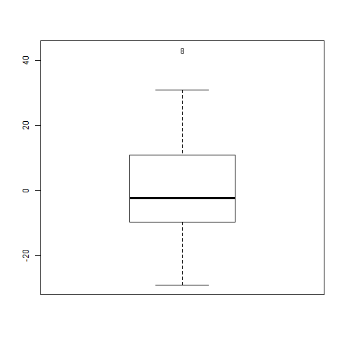 

---

## 3. Graphics with R

* R provides the usual range of standard statistical plots, including scatterplots,
boxplots, histograms, barplots, piecharts, and basic 3D plots

* Basically, these plots can be produced by a single function call. (high-level functions)

* R is also able to add several graphical elements together. (text, lines, points, axis,...)

---

## First example of R graphics

```r
plot(pressure)  # high-level funtion
text(150, 600, "Hello Stata Users!") # adding graphical element: text
```

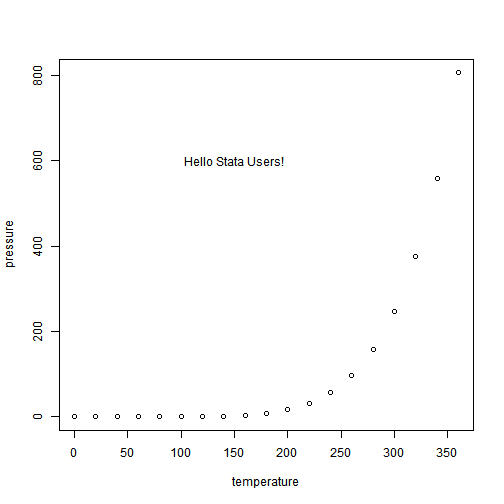 


## High-level functions:

* Scatter plot: `plot()`, can be used for dot plot and line chart
 
* Box and whisker plot: `boxplot()`

* Histogram: `hist()`

* Bar chart: `barplot()`

---

## High-level functions:
__ An example__

```r
par(mfrow=c(2, 2)) ## create 4 panels
N <- 200
x <- runif(N, -4, 4)
y <- sin(x) + 0.5*rnorm(N)
plot(x, y, main="Scatter plot of y and x")
hist(x, main="Histogram of x")
boxplot(y, main="Box plot of y")
barplot(x, main="Bar chart of x")
```

---

## High-level functions
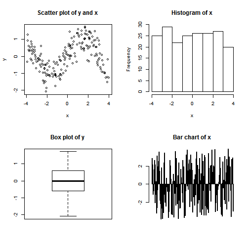 

---

## Scatter plot:
* Main parameters: `x=, y=, xlab=, ylab=, pch=, main=, type=, col=`


```r
plot(x = cars$speed, y = cars$dist) 
```

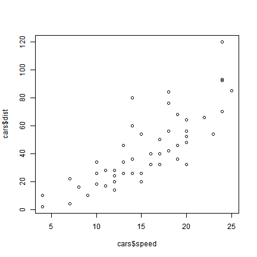 

---

## Scatter plot:
* R control characteristics of graphs via parameters: x, y, xlab, ylab,....


```r
plot(x=cars$speed, y=cars$dist,
       xlab = "Speed (miles per hour)", # rename x label
       ylab = "Stopping distance", # rename y label
       main = "Scatter plot",  # title of the plot
       cex.main = 1.6, ## Resize the title text
       tck = -0.015, ## Resize the tick mark
       pch = 16, col = "purple", ## choose another point character and set color
       las = 1, bty = "l",  # change the frame from "o" to "l"
	      col.lab = "red4", cex.lab = 1.3, # change color and size of label
	      col.axis = "black",  # change color of 
	      col.main = "red4") # change color of title
```

---

## Scatter plot:

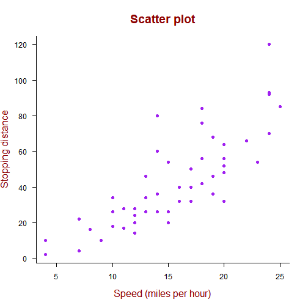 

---

## Scatter plot:


```r
par(mfrow=c(1, 2))
plot(x=cars$speed, y=cars$dist)
plot(x=cars$speed, y=cars$dist, pch=16, col="purple", bty="l", las=1,
     xlab="Speed (mph)", ylab="Stopping distance", main="Scatter plot")
```

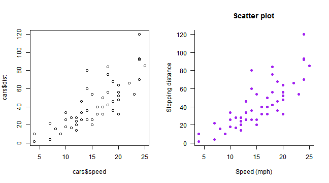 

---

## Line chart
__Argument: type="l"__

```r
par(mfrow=c(1, 2)); library(ggplot2)
plot(pressure$temperature, pressure$pressure, type="l")
plot(pressure$temperature, pressure$pressure, type="b")
```

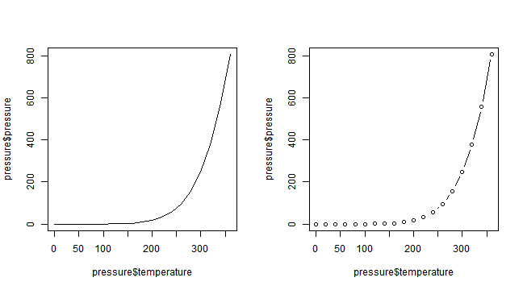 

---

## line charts
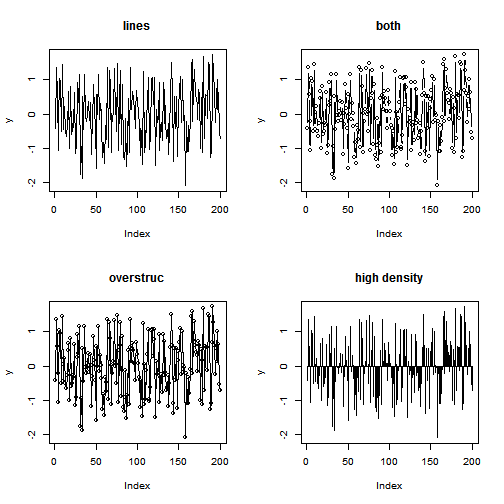 

---

## Line graph: 

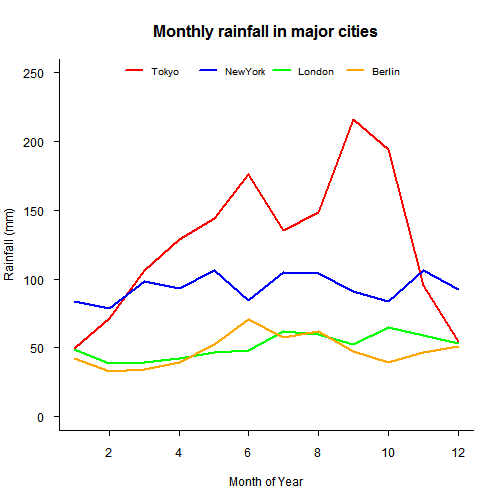 

---

## Box and whisker plot:

```r
boxplot(len ~ supp + dose, data=ToothGrowth)
```

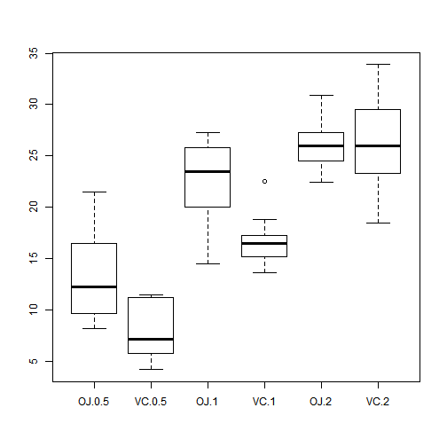 


---

## Histogram:

```r
par(mfrow=c(1,2))
hist(mtcars$mpg)
hist(mtcars$mpg, breaks=10, col="steelblue")
```

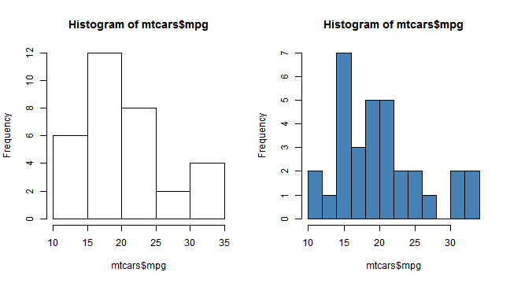 

---

## Bar chart:

```r
barplot(table(mtcars$cyl))
```

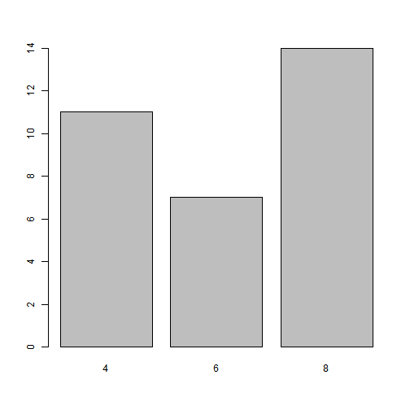 

---

## Bar chart:
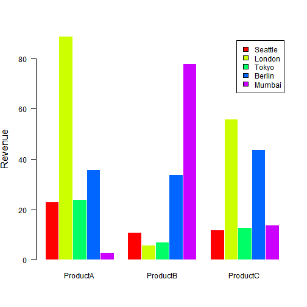 

---

## Miscellaneous graphs

* Correlation matrix

* Network graph

* Dynamic graph

---

## Correlation matrix plot
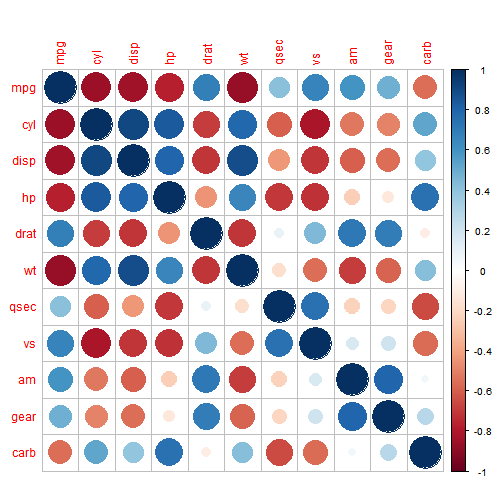 

---

## Network graph
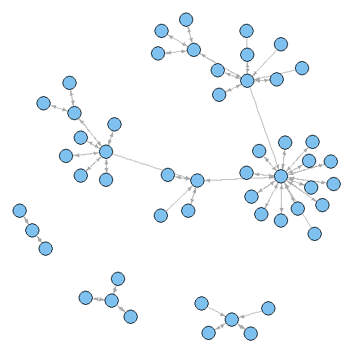 

---

## Dynamic graphics
<!-- MotionChart generated in R 3.0.0 by googleVis 0.4.2 package -->
<!-- Tue Apr 09 15:05:08 2013 -->


<!-- jsHeader -->
<script type="text/javascript">
 
// jsData 
function gvisDataMotionChartID19d05612730e () {
  var data = new google.visualization.DataTable();
  var datajson =
[
 [
 "Apples",
2008,
"West",
98,
78,
20,
"2008-12-31" 
],
[
 "Apples",
2009,
"West",
111,
79,
32,
"2009-12-31" 
],
[
 "Apples",
2010,
"West",
89,
76,
13,
"2010-12-31" 
],
[
 "Oranges",
2008,
"East",
96,
81,
15,
"2008-12-31" 
],
[
 "Bananas",
2008,
"East",
85,
76,
9,
"2008-12-31" 
],
[
 "Oranges",
2009,
"East",
93,
80,
13,
"2009-12-31" 
],
[
 "Bananas",
2009,
"East",
94,
78,
16,
"2009-12-31" 
],
[
 "Oranges",
2010,
"East",
98,
91,
7,
"2010-12-31" 
],
[
 "Bananas",
2010,
"East",
81,
71,
10,
"2010-12-31" 
] 
];
data.addColumn('string','Fruit');
data.addColumn('number','Year');
data.addColumn('string','Location');
data.addColumn('number','Sales');
data.addColumn('number','Expenses');
data.addColumn('number','Profit');
data.addColumn('string','Date');
data.addRows(datajson);
return(data);
}
 
// jsDrawChart
function drawChartMotionChartID19d05612730e() {
  var data = gvisDataMotionChartID19d05612730e();
  var options = {};
options["width"] =    600;
options["height"] =    500;

     var chart = new google.visualization.MotionChart(
       document.getElementById('MotionChartID19d05612730e')
     );
     chart.draw(data,options);
    

}
  
 
// jsDisplayChart
(function() {
  var pkgs = window.__gvisPackages = window.__gvisPackages || [];
  var callbacks = window.__gvisCallbacks = window.__gvisCallbacks || [];
  var chartid = "motionchart";

  // Manually see if chartid is in pkgs (not all browsers support Array.indexOf)
  var i, newPackage = true;
  for (i = 0; newPackage && i < pkgs.length; i++) {
    if (pkgs[i] === chartid)
      newPackage = false;
  }
  if (newPackage)
    pkgs.push(chartid);

  // Add the drawChart function to the global list of callbacks
  callbacks.push(drawChartMotionChartID19d05612730e);
})();
function displayChartMotionChartID19d05612730e() {
  var pkgs = window.__gvisPackages = window.__gvisPackages || [];
  var callbacks = window.__gvisCallbacks = window.__gvisCallbacks || [];
  window.clearTimeout(window.__gvisLoad);
  // The timeout is set to 100 because otherwise the container div we are
  // targeting might not be part of the document yet
  window.__gvisLoad = setTimeout(function() {
    var pkgCount = pkgs.length;
    google.load("visualization", "1", { packages:pkgs, callback: function() {
      if (pkgCount != pkgs.length) {
        // Race condition where another setTimeout call snuck in after us; if
        // that call added a package, we must not shift its callback
        return;
      }
      while (callbacks.length > 0)
        callbacks.shift()();
    } });
  }, 100);
}
 
// jsFooter
 </script>
 
<!-- jsChart -->  
<script type="text/javascript" src="https://www.google.com/jsapi?callback=displayChartMotionChartID19d05612730e"></script>
 
<!-- divChart -->
  
<div id="MotionChartID19d05612730e"
  style="width: 600px; height: 500px;">
</div>

---

## Conclusions

* R operates on data structure (and the fundamental type is vector)

* R manipulates data by functions, and R controls functions through
  parameters (both statistical functions and graphics function apply to the same principle)
  
---


